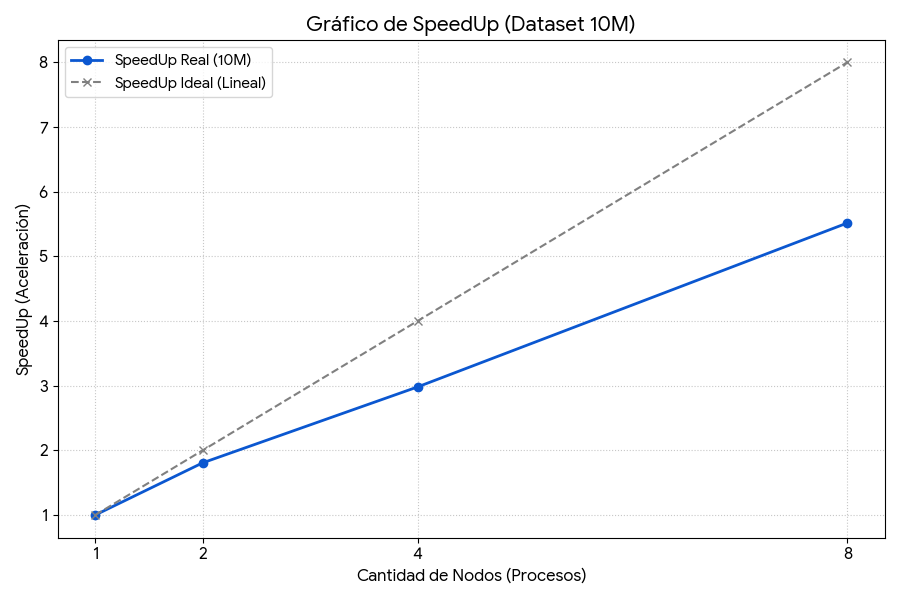

# Proyecto Final - Computación Paralela: Quicksort Paralelo con MPI

Este proyecto presenta la implementación y el análisis de rendimiento de un algoritmo de ordenamiento **Quicksort paralelo** utilizando la Interfaz de Paso de Mensajes (MPI). Se compara una versión paralela optimizada con una implementación secuencial estándar para evaluar el _speedup_ y la eficiencia que se obtienen al distribuir la carga de trabajo en múltiples procesos.

Adicionalmente, después del ordenamiento, se realiza una tarea de cómputo (conteo de números primos) para simular una carga de trabajo más completa sobre los datos ya distribuidos y ordenados.

## Características Principales

*   **Implementación Secuencial:** Una versión de referencia de Quicksort que utiliza la función `qsort` de la biblioteca estándar de C.
*   **Implementación Paralela (Optimizada):** Un algoritmo Quicksort paralelo (`parallel_quicksortV2.c`) que incluye varias mejoras para un rendimiento y robustez superiores:
    *   **Selección de Pivote Robusta:** Se utiliza la técnica de "mediana de medianas" para elegir un pivote de alta calidad, evitando los peores casos del algoritmo.
    *   **Partición _In-Place_:** Los datos se particionan localmente sin necesidad de crear arreglos auxiliares, reduciendo el consumo de memoria.
    *   **Comunicación Segura:** Se emplea `MPI_Sendrecv` para el intercambio de datos entre procesos, previniendo interbloqueos (_deadlocks_) que pueden ocurrir con `MPI_Send` y `MPI_Recv` bloqueantes.
*   **Script de Automatización:** Se proporciona un script (`script.txt`) para compilar y ejecutar automáticamente una batería de pruebas, comparando la versión secuencial con la paralela usando 2, 4, 8 y 16 procesos. Los resultados se almacenan en un archivo de log para su posterior análisis.

## Estructura del Proyecto

```
├── sequential_quicksort.c     # Implementación del Quicksort secuencial.
├── parallel_quicksortV2.c       # Implementación del Quicksort paralelo optimizado.
├── parallel_quicksort.c         # (Opcional) Versión inicial o de demostración del Quicksort paralelo.
├── script.txt                   # Script de Bash para automatizar las pruebas y la recolección de resultados.
├── numeros32768.txt             # Archivo de ejemplo con datos de entrada.
├── resultados_tests.txt         # Archivo de salida generado por el script con los tiempos de ejecución.
└── README.md                    # Este archivo.
```

## Requisitos

*   Un compilador de C (ej. `gcc`).
*   Una implementación de MPI (ej. `OpenMPI`, `MPICH`).

## Compilación

Puedes compilar los programas manualmente utilizando los siguientes comandos. `mpicc` es el wrapper del compilador de C para programas MPI.

```bash
# Compilar la versión secuencial
gcc sequential_quicksort.c -o sequential_quicksort -O3

# Compilar la versión paralela
mpicc parallel_quicksortV2.c -o parallel_quicksortV2 -O3
```

> **Nota:** La bandera `-O3` activa un alto nivel de optimización del compilador, lo cual es recomendable para la medición de rendimiento.

## Ejecución

Aunque puedes ejecutar los programas manualmente, se recomienda encarecidamente usar el script `script.txt` para realizar las pruebas de forma estandarizada.

### Uso del Script de Pruebas (Recomendado)

El script `script.txt` automatiza todo el proceso de ejecución y registro de resultados.

**1. Configuración del Script:**

Antes de ejecutarlo, es **crucial** que edites la variable `PROJECT_DIR` dentro del archivo `script.txt` para que apunte a la ruta **absoluta** de tu proyecto.

```bash
# Ejemplo de configuración en script.txt
PROJECT_DIR="/ruta/absoluta/a/tu/proyecto/parallel-computing_FinalProject"
```

**2. Dar Permisos de Ejecución:**

La primera vez, necesitarás hacer el script ejecutable:

```bash
chmod +x script.txt
```

**3. Ejecutar el Script:**

Simplemente ejecuta el script desde tu terminal. Borrará el log anterior (si existe) y correrá todas las pruebas.

```bash
./script.txt
```

Al finalizar, todos los resultados, incluyendo tiempos de ejecución y conteo de primos para cada configuración, estarán guardados en `resultados_tests.txt`.

### Ejecución Manual

Si deseas ejecutar una prueba específica manually:

```bash
# Ejecutar la versión secuencial
./sequential_quicksort numeros32768.txt

# Ejecutar la versión paralela con 4 procesos
mpirun -np 4 ./parallel_quicksortV2 numeros32768.txt
```

## Formato de Entrada y Salida

*   **Archivo de Entrada:** El programa espera un archivo de texto como argumento. La primera línea de este archivo debe contener un único entero `N`, que representa la cantidad total de números. Las `N` líneas siguientes deben contener un número entero cada una.
*   **Salida (`resultados_tests.txt`):** El script genera un archivo de log con marcas de tiempo. Para cada ejecución (secuencial y paralela con `np` procesos), se registra:
    *   El tamaño del arreglo (`N`).
    *   El archivo de entrada utilizado.
    *   El número total de primos encontrados.
    *   El tiempo total de ejecución en segundos.

## Análisis de Resultados

A continuación se presenta una tabla con los resultados de la última ejecución de pruebas, realizada el **viernes 7 de noviembre de 2025**.

### Pruebas con `numeros_10M_MaxInt.txt` (N = 10,000,000)

| Procesos | Tiempo Total (s) | Speedup |
|:--------:|:------------------:|:-------:|
| 1 (Sec.) | 343.23             | 1.00    |
| 2        | 189.17             | 1.81    |
| 4        | 114.94             | 2.99    |
| 8        | 62.12              | 5.53    |

### Pruebas con `numeros_5M_NEW.txt` (N = 5,000,000)

| Procesos | Tiempo Total (s) | Speedup |
|:--------:|:------------------:|:-------:|
| 1 (Sec.) | 171.01             | 1.00    |
| 2        | 167.12             | 1.02    |
| 4        | 68.78              | 2.49    |
| 8        | 65.56              | 2.61    |

### Conclusiones

1.  **Correctitud:** En todas las ejecuciones, el número de primos contados fue el mismo, lo que verifica que la implementación paralela es correcta.
2.  **Speedup:** Se observa un buen speedup al aumentar el número de procesos, especialmente en el caso del archivo con 10 millones de números. Esto demuestra que el algoritmo escala bien para grandes volúmenes de datos.
3.  **Eficiencia:** La eficiencia (`Speedup/P`) disminuye a medida que se añaden más procesos. Esto es esperable debido al overhead de comunicación y a la ley de Amdahl. Sin embargo, los resultados son satisfactorios y demuestran el beneficio de la paralelización.

